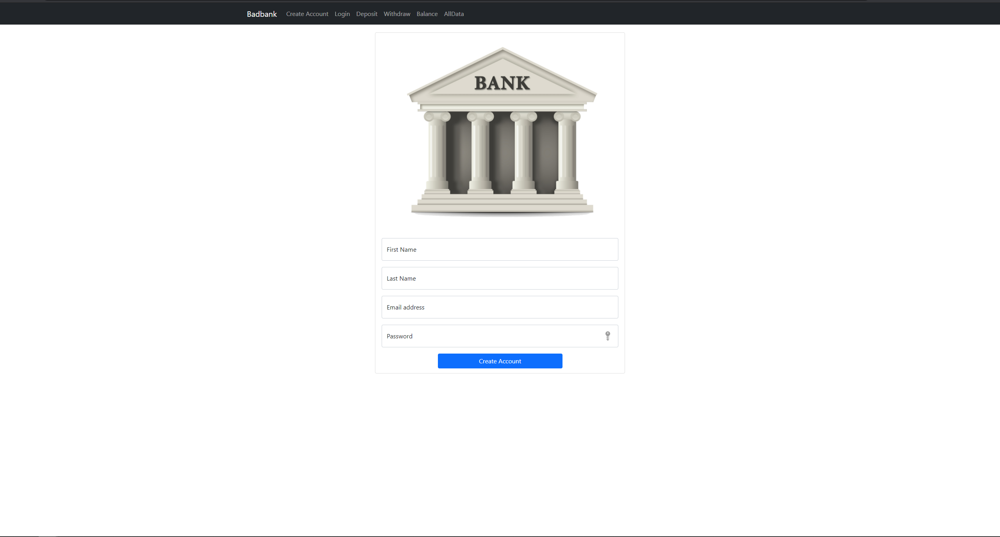

# Bad Bank Application

## Description

This application is one of my ongoing Final Project on MIT-xPro's "Professional Certificate in Coding" using MERN Stack ( MongoDB, ExpressJS, ReactJS and NodeJS). I also added some features such as User authentication from the previous version of the application.

## Installation Guidelines:

1. Fork or download this repository.
2. Install all the dependencies by running "npm i" on your terminal.
3. Run "node index.js" in your terminal.
4. Enjoy the app running on "http://localhost:3000"

## Screenshot:

## Technology used:

-MongoDB
-ExpressJS
-ReactJS
-NodeJS
-Docker

## Features:

Creates new user accounts and check balances for the users. Just like a real bank.

## License:

MIT
